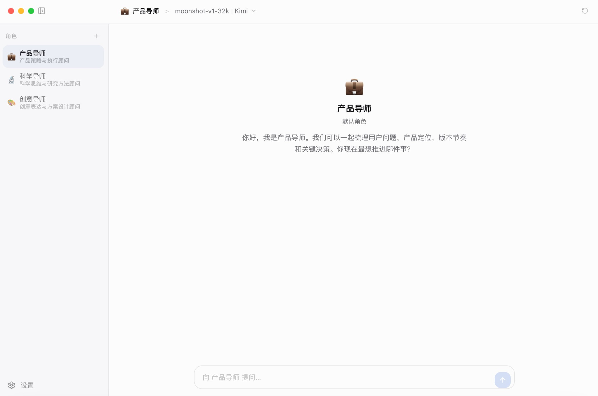

<p align="center">
  
</p>

<h1 align="center">Open Master</h1>

<p align="center">
  <strong>创建具备不同风格与专长的 AI 导师助手</strong>
</p>

<p align="center">
  <a href="https://github.com/open-master/open-master/releases/latest">📦 下载安装包</a> •
  <a href="#功能特性">功能特性</a> •
  <a href="#快速开始">快速开始</a> •
  <a href="#路线图">路线图</a>
</p>

---

## 简介

> 用你自己的设定、知识和风格，打造真正长期可用的 AI 导师助手。

Open Master 是一个开源的 AI 导师助手平台，内置产品导师、科学导师、创意导师等默认角色，也支持你自定义角色的人格、知识和音色。当前 `v0.1.1` 版本聚焦于 macOS Apple Silicon 桌面客户端，提供一套本地优先、可持续积累上下文与知识的 AI 工作台体验。

## 功能特性

### 🧠 三层记忆架构

- **短期记忆** — 当前对话上下文，确保连贯的多轮对话
- **长期记忆** — 跨会话的事实提取，记住用户偏好与信息
- **知识记忆** — 时序知识图谱，存储角色知识、项目背景与结构化事实

### 🎙️ 语音合成

- 每个角色都可以配置独特声线
- 支持流式播放和自动朗读
- 可调节语速、音色，支持 40+ 种语言
- 支持为你有权使用的音频生成专属复刻音色

### 🎭 默认角色与自定义角色

- 内置产品导师、科学导师、创意导师三种默认角色
- 支持创建自定义角色，配置名称、提示词、开场白与音色
- 默认角色提供开箱即用的基础人格与知识包

### 🖥️ 跨平台桌面客户端

- macOS / Windows / Linux 原生体验
- 支持系统级窗口管理
- 所有数据本地存储，隐私安全

### 🤖 多模型支持

- Anthropic (Claude)、OpenAI (GPT)、OpenRouter、DeepSeek、Kimi
- 用户自行配置 API Key，灵活切换

### 🎵 Vibe 音乐（v0.1.1 新增）

- 实时监控 [OpenClaw](https://github.com/openclaw/openclaw) 工作状态（当前支持云端部署），自动切换匹配氛围的音乐
- 三种工作状态识别：工作中 → Lo-fi 专注、任务完成 → 交响庆祝、空闲 → 轻柔休息
- 支持手动上传音乐，为每首歌标记适配的工作状态（可多选）
- 支持 AI 生成音乐（MiniMax API），用户手动触发并提醒费用
- 播放优先级：上传音乐 > AI 生成音乐 > 无音乐静默提示
- 基于规则引擎的状态识别，无额外 AI 调用开销

### 📋 OpenClaw 管理面板（v0.1.1 新增）

- 通过 WebSocket 主动连接 OpenClaw，实时监控 Session 列表
- 独立窗口面板，支持拖拽、置顶，不干扰主窗口操作
- 查看 Session 对话内容，支持 Markdown 渲染
- 向 Session 发送消息、中止正在运行的任务
- Ed25519 设备身份认证与一键配对流程

### ✨ 更多特性

- Apple 设计哲学的简洁 UI
- 对话历史持久化，关闭应用不丢失
- 消息一键复制、删除
- 自定义角色（自定义人格提示词）
- 深色 / 浅色 / 跟随系统主题

## 快速开始

### 下载安装

> 普通用户直接下载安装包即可使用，无需任何技术背景。

从 [Releases](https://github.com/open-master/open-master/releases/latest) 下载对应平台的安装包：

| 平台 | 状态 |
|---|---|
| macOS (Apple Silicon) | ✅ 已支持 |
| Windows | 🚧 即将支持 |
| Linux | 🚧 即将支持 |

安装后打开应用，在**设置**中配置：

1. **LLM 服务商** — 配置 API Key（推荐 [Kimi](https://platform.moonshot.cn) 或 [DeepSeek](https://platform.deepseek.com)，性价比高）
2. **Embedding 服务** — 配置 API Key（推荐 [SiliconFlow](https://siliconflow.cn)，免费注册，用于记忆功能）
3. **语音合成**（可选）— 配置 [MiniMax](https://platform.minimaxi.com) API Key，为角色配置声音或复刻音色
4. **Vibe 音乐**（可选）— 在设置中启用 Vibe 模式，配置 OpenClaw WebSocket 地址，上传或生成匹配工作状态的音乐

配置完成即可开始对话。所有配置和数据仅保存在本地，不会上传到任何服务器。

> 请仅上传你拥有合法使用权的角色资料、名称、图片与音频内容。

### 开发部署

> 面向开发者，从源码构建和二次开发。

**前置要求：** Node.js 22+、Docker & Docker Compose（推荐，用于 Web 端、长期记忆与知识图谱开发）。

> **说明：** 普通用户使用发布版桌面客户端时，系统角色知识包已内置到客户端中，**不再需要 Docker**。下面的 Docker 说明主要面向源码开发者。

```bash
# 克隆项目
git clone https://github.com/open-master/open-master.git
cd open-master
npm install --legacy-peer-deps

# 复制环境配置文件并按需修改
cp .env.example .env
```

**方式一：仅使用 Web 端**

```bash
docker compose up -d                  # 启动全部服务，访问 http://localhost:3100
```

**方式二：仅使用 Electron 客户端**

```bash
docker compose up -d mem0-service memory-engine  # 启动记忆与知识图谱服务
npm run dev                                        # 启动本地 Next 开发服务，端口 3000
npm run electron:dev                               # 启动桌面客户端壳层
```

**方式三：Web 端 + 客户端同时运行**

```bash
docker compose up -d                                # 启动 Web 端与后端服务（Web 端在 3100 端口）
npm run dev                                         # 启动本地 Next 开发服务（Electron 使用 3000 端口）
npm run electron:dev                                # 启动桌面客户端壳层
```

> **💡 说明 1：** Docker Web 端默认使用 **3100 端口**，本地 `npm run dev` 默认使用 **3000 端口**，`electron:dev` 会连接本地的 **3000** 端口，因此它本身**不会自动启动 Next 开发服务**。
>
> **💡 说明 2：** 桌面发布版会自动拉起内置的 `mem0-service` 与 `knowledge-engine`；但在源码开发模式下，相关服务仍建议通过 Docker 单独启动。
>
> **💡 说明 3：** Web 端与 Electron 客户端在开发环境下可共用同一组后端服务，但对话历史和本地记忆数据并不天然共享，需按各自运行环境分别理解。

**打包桌面客户端：**

```bash
npm run electron:pack:mac     # macOS Apple Silicon
```

> 当前仓库已验证并提供 `macOS Apple Silicon` 打包流程；Windows / Linux 打包脚本尚未在 `package.json` 中提供。

## 版本历史

### v0.1.1（当前版本）

- **Vibe 音乐** — 实时监控 OpenClaw 工作状态，自动播放匹配氛围的音乐；支持上传和 AI 生成
- **OpenClaw 管理面板** — 独立窗口实时查看和管理 OpenClaw Session，支持发送消息与中止任务
- **WebSocket 主动连接** — 替代 Webhook 被动模式，无需暴露本地 IP，支持 Ed25519 设备认证与配对
- **安装包体积优化** — 修复打包时冗余文件携带问题，DMG 体积从 800M+ 恢复至 ~246M

### v0.1.0

- 基础多轮对话
- 多模型切换（Anthropic / OpenAI / OpenRouter / DeepSeek / Kimi）
- 三层记忆架构（短期 + 长期 + 知识图谱）
- 语音合成与音色复刻
- macOS Apple Silicon 桌面客户端

## 后续计划

- 语音输入（STT）
- 图像理解
- Windows / Linux 客户端支持
- 实时语音对话
- 多角色协作

## 许可证

MIT License

## 致谢

- [Vercel AI SDK](https://sdk.vercel.ai/) — AI 对话框架
- [Mem0](https://github.com/mem0ai/mem0) — 长期记忆引擎
- [Graphiti](https://github.com/getzep/graphiti) — 时序知识图谱
- [MiniMax](https://platform.minimaxi.com/) — 语音合成 & 音乐生成
- [OpenClaw](https://github.com/openclaw/openclaw) — 个人 AI 助手平台
- [Electron](https://www.electronjs.org/) — 桌面应用框架
- [shadcn/ui](https://ui.shadcn.com/) — UI 组件库

## Star History

<a href="https://star-history.com/#open-master/open-master&Date">
 <picture>
   <source media="(prefers-color-scheme: dark)" srcset="https://api.star-history.com/svg?repos=open-master/open-master&type=Date&theme=dark" />
   <source media="(prefers-color-scheme: light)" srcset="https://api.star-history.com/svg?repos=open-master/open-master&type=Date" />
   
 </picture>
</a>
